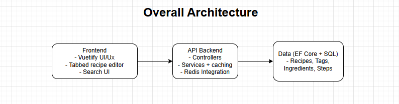

# Recipe Management App (RMA)

A modern, full-stack recipe management system built with Vue 3 + Vuetify and ASP.NET Core. Supports creating, editing, searching, and benchmarking recipe data with Redis caching and SQL persistence.

---

## Running the application deployed

1. Backend Api : https://apiservice.wonderfulrock-4e9ab187.eastus2.azurecontainerapps.io/index.html
2. Frontend : https://recipe-frontend-gefec3c2bxbzghgb.canadacentral-01.azurewebsites.net/
3. Dashboard metrics: https://aspire-dashboard.ext.wonderfulrock-4e9ab187.eastus2.azurecontainerapps.io/

## 🚀 Features

* 🧾 Full CRUD for recipes, including ingredients, steps, and tags
* 🔍 Search across title, description, and tags
* 🧪 Full test suite with integration tests & validation checks
* ⚡ Redis caching for tag- and search-based lookups
* 🧱 Scalable architecture with separation of concerns
* 📊 Benchmarking for performance (500x GET latency)

---

## 📐 Architecture Diagram



---

## 🛠 Setup Instructions

### 📦 Prerequisites

* Node.js >= 18.x
* .NET 8 SDK
* Redis (optional, for caching)
* SQL Server / PostgreSQL (or SQLite for dev)

### ⬇️ Clone & Run

```bash
# Clone
git clone https://github.com/Fani2000/recipe-management-app.git
cd rma

cd src/

# Frontend setup
cd RMA.Frontend/
npm install

# Backend setup
cd ../RMA.AppHost
dotnet restore
DOTNET_ENVIRONMENT=Development && dotnet run
```

---

## 📚 API Endpoints

| Method | Endpoint          | Description                     |
| ------ | ----------------- | ------------------------------- |
| GET    | /api/recipes      | List recipes (with filters)     |
| GET    | /api/recipes/{id} | Get single recipe by ID         |
| POST   | /api/recipes      | Create recipe (validates model) |
| PUT    | /api/recipes/{id} | Update existing recipe          |
| DELETE | /api/recipes/{id} | Delete a recipe                 |

Supports filtering by:

* `search`, `tag`, `maxCookingTime`, `sortBy`, `ascending`

---

## 📈 Benchmark

Executed in Release mode against local SQL database:

```
| Method             | Mean      | Error     | StdDev    |
|-------------------|-----------|-----------|-----------|
| GetAllRecipes_500 | 138.42 ms | ±3.05 ms  | ±3.97 ms  |
```

✅ Avg latency per request: \~12.8 ms

---

## 🔒 Validation Rules

| Field              | Rule                          |
| ------------------ | ----------------------------- |
| Title              | Required, max 150 characters  |
| Description        | Required, max 1000 characters |
| CookingTimeMinutes | Must be between 1 and 1440    |
| Image              | Must be a valid URL           |

All validated via `[Required]`, `[Range]`, `[StringLength]` attributes in the model.

---

## 🧪 Test Coverage

* ✅ API lifecycle: POST + GET + DELETE
* ✅ Validation failures: title missing, cooking time zero
* ✅ Performance load test: 500x GETs

Run tests:

```bash
cd backend/tests
dotnet test
```

---

## 📌 Notes

* Caching uses `IDistributedCache` (Redis recommended)
* Works with Docker & cloud-ready deployments
* Architecture decisions and trade-offs in [SOLUTION.md](./SOLUTION.md)

---

## 📄 License

MIT or your preferred open license
