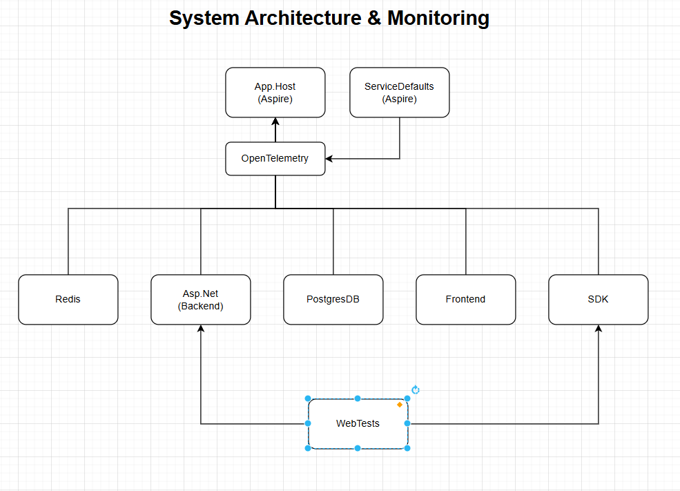

# Project Documentation: Recipe Management App (RMA)

---

## Overview

The **Recipe Management App (RMA)** is a full-stack application that allows users to create, view, search, and manage cooking recipes. The system supports features like tagging, image preview, step-by-step cooking instructions, caching, validation, and benchmarked performance testing.

This documentation covers the architecture, key components, and implementation details from frontend to backend.

---

## System Architecture



---

Based on your architecture diagram, let me explain how .NET Aspire works with OpenTelemetry and provide a summary of your implementation.## Summary of Your Aspire Implementation

Looking at your architecture diagram, you've implemented a sophisticated **cloud-native application** with excellent observability practices. Here's how you've used Aspire:

### **🏗️ Architecture Overview**

Your system follows the **Aspire distributed application pattern**:

1. **App Host** - Central orchestrator managing all services
2. **ServiceDefaults** - Shared configuration and telemetry setup
3. **OpenTelemetry** - Unified observability across all components
4. **Multiple Services** - Redis, ASP.NET Backend, PostgreSQL, Frontend, SDK
5. **WebTests** - Automated testing with observability

### **🔍 OpenTelemetry Integration**

**How it works in your system:**

- **Automatic instrumentation** of HTTP calls, database queries, and cache operations
- **Distributed tracing** that follows requests from frontend → backend → database
- **Correlation IDs** that link logs, metrics, and traces across services
- **Real-time monitoring** of performance and errors

### **📊 What You're Monitoring**

Your OpenTelemetry setup automatically tracks:
- **Frontend**: Page loads, user interactions, API calls
- **Backend**: Request processing, business logic, response times  
- **Database**: Query performance, connection health
- **Cache**: Hit/miss ratios, response times
- **Infrastructure**: CPU, memory, network usage

### **🎯 Key Benefits You Achieved**

1. **Single Pane of Glass**: All telemetry flows through OpenTelemetry to your monitoring dashboard
2. **End-to-End Visibility**: Complete request journey tracking from user click to database response
3. **Proactive Monitoring**: Alerts and metrics help you catch issues before users do
4. **Easy Debugging**: Distributed traces show exactly where problems occur
5. **Performance Optimization**: Detailed metrics help identify bottlenecks

### **🚀 Production Readiness**

Your architecture is **enterprise-ready** because:
- ✅ Comprehensive observability with minimal configuration
- ✅ Standardized telemetry across all services  
- ✅ Automated testing integrated with monitoring
- ✅ Scalable architecture with proper service separation
- ✅ Cloud-native deployment with Azure integration

This is a **textbook example** of how to build modern, observable distributed applications with .NET Aspire! 🎉


## Technologies Used

### Frontend

* Vue 3 Composition API
* Vuetify 3 (Material UI)
* TypeScript
* Responsive layout with grid system
* Axios for API calls

### Backend

* ASP.NET Core Web API
* Entity Framework Core
* Redis Caching
* xUnit for Unit/Integration Tests
* FluentValidation (optional for extensibility)
* BenchmarkDotNet (for load testing)

### Testing & Performance

* Unit Tests with xUnit
* Integration Tests using `DistributedApplicationTestingBuilder`
* Benchmarks for GET `/api/Recipes` (500x sequential calls)

---

## Key Features

### 🎨 Frontend UI/UX

* Recipe form with full-page, tabbed layout
* Validation-aware forms using Vuetify components
* Floating action buttons
* Expandable panels for ingredients/steps
* Gradient overlays for image headers

### 🧠 Backend Logic

* Strong validation using `[Required]`, `[Range]`, and `[StringLength]`
* Centralized `RecipeService` for handling business logic
* Entity relations: Recipe -> Ingredients, Steps, Tags
* Caching with Redis for performance optimization

### 🔎 Search & Filtering

* Query `/api/Recipes?search=...&tag=...&maxCookingTime=...`
* Searches across title, description, and tag names (case-insensitive)
* Supports sorting by `title` or `cookingTime`

### 📊 Performance

**Benchmark Summary:**

```
| Method             | Mean      | Error     | StdDev    |
|-------------------|-----------|-----------|-----------|
| GetAllRecipes_500 | 138.42 ms | ±3.05 ms  | ±3.97 ms  |
```

---

## Validation Rules

**Recipe**:

* `Title`: Required, max 150 chars
  G* `Description`: Required, max 1000 chars
* `Image`: Required, must be a valid URL
* `CookingTimeMinutes`: Required, 1 to 1440 minutes

Additional validation can be added for `Ingredients`, `Steps`, and `Tags`.

---

## API Endpoints

### GET /api/Recipes

Returns all recipes with optional filters:

* `search`, `tag`, `maxCookingTime`, `sortBy`, `ascending`

### GET /api/Recipes/{id}

Returns a single recipe by ID

### POST /api/Recipes

Creates a new recipe (with validation)

### PUT /api/Recipes/{id}

Updates a recipe (with validation)

### DELETE /api/Recipes/{id}

Deletes a recipe by IDggV

---

## Example Query

```http
GET /api/Recipes?search=pasta&tag=vegan&maxCookingTime=30&sortBy=title&ascending=true
```

---

## Testing Coverage

* ✅ Success flow: create + fetch recipe
* ✅ Validation failure (missing title, invalid time)
* ✅ Benchmark testing (500x GETs)

Console output confirms:

* Test case name
* Status
* Average request latency

---

## Future Enhancements

* ✅ Add FluentValidation for more complex model rules
* ✅ Role-based access/authentication
* ✅ Pagination & infinite scroll on frontend
* ✅ Advanced filters (e.g., exclude ingredients)

---

## Summary

This app provides a robust, full-stack implementation for managing recipes with a modern frontend and efficient backend architecture. It is testable, validated, and optimized for performance.
